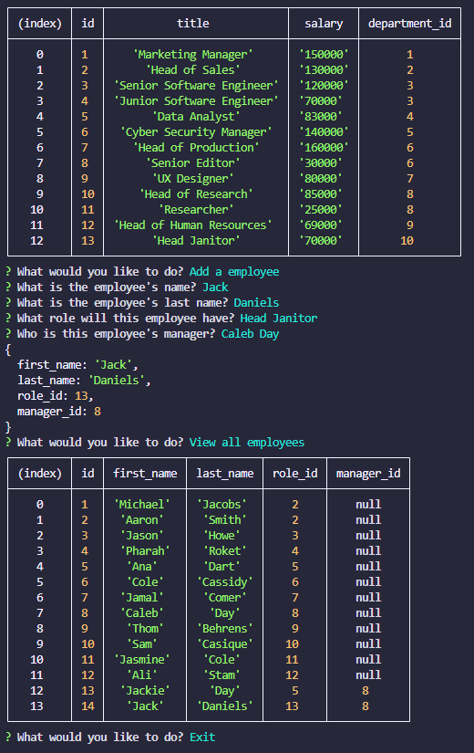

<h1 id='title'> Employee Tracker </h1>


<h2 id='contents'> Table of Contents </h2>

* [Description](#description)

* [MIT License](#license)

* [Installation](#installation)

* [Usage](#usage)
 
* [Tests](#tests)

* [Contributors](#contributors)

* [Questions](#questions) 

<h2 id='description'> Description </h2>

A command-line application that creates tables of data representing departments, roles, and employees for a company.

Video of the application in action:

[Employee Tracker video link!](https://drive.google.com/file/d/16U4M3IDaNrvzZ2_YGQk5z6gvFLP_9sCc/view)

Visuals:

<kbd>

</kbd>

<p style='text-align: right;'><a href='#title'>Back to top</a></p>

<h2 id='license'>License</h2>

      Copyright © MIT. All rights reserved.
      
      Lincensed under the MIT license.

<p style='text-align: right;'><a href='#title'>Back to top</a></p>

<h2 id='installation'> Installation </h2>

Run these commands to install description:

```
npm i
```

<p style='text-align: right;'><a href='#title'>Back to top</a></p>

<h2 id='usage'> Usage </h2>

* First, make sure you are in the root folder, then run "npm i".
* Then run mysql with the command: "mysql -u (your mysql username) -p". You will be prompted to add you password.
* In the mysql shell, source the schema.sql file using command: "source ./db/schema.sql".
* Then exit out of the shell with the following: "exit" command.
* enter you mysql username and password into the connection.js file in the 'lib' folder.
* Lastly, enter the command: "node index.js" and follow the prompts to enter you workforce. 


<p style='text-align: right;'><a href='#title'>Back to top</a></p>


<h2 id='questions'> Questions </h2>

If you have any questions, contact:

day.caleb@gmail.com

<p style='text-align: right;'><a href='#title'>Back to top</a></p>
